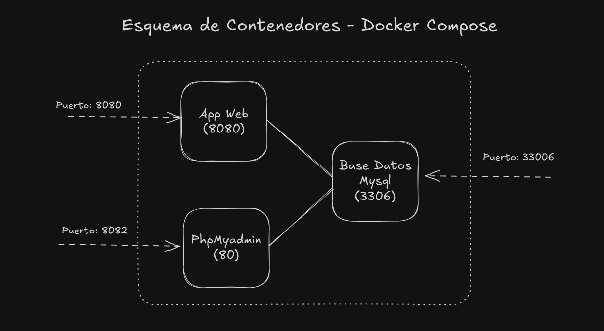

# Ejemplo básico de Docker Compose
En la definición del archivo `docker-compose.yaml`, vamos a utilizar una imagen existente para nosotros subir utilizar el servicio. Los comandos que estaremos probando:

- docker compose up
- docker compose stop
- docker compose start
- docker compose down
- docker compose ps
- docker compose logs 

Para ejecutar archivo de docker compose utilizar el siguiente comando:
```
docker compose up
```

El esquema estaremos utilizando:

